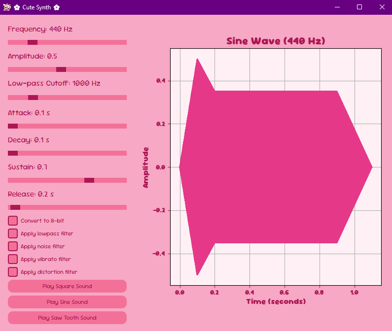
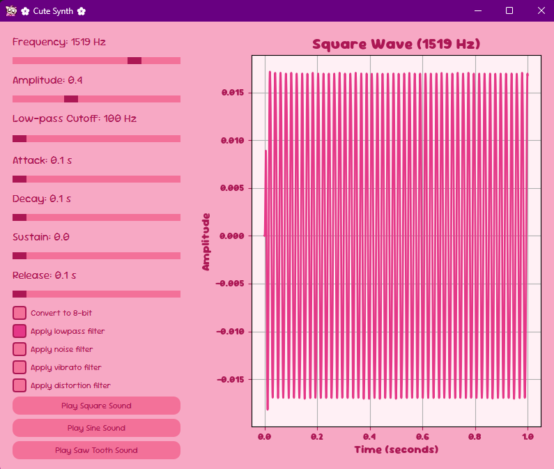

<a id="readme-top"></a>


<!-- PROJECT LOGO -->
<br />
<div align="center">
  <a href="https://github.com/hawwokitty/audio_prog">
    
  </a>

<h3 align="center">Cute Synth</h3>

  <p align="center">
    A fun and cute audio generator program made with Python!
  </p>
</div>

<!-- ABOUT THE PROJECT -->
## About The Project
<p>Cute Synth is a simple yet powerful Python-based synthesizer that generates different waveforms (sine, square, sawtooth) and applies various effects. It features a GUI built with PyQt6, allowing easy interaction with audio parameters.</p>

### Built With

* Python (Main language)
* PyQt6 (GUI)
* Matplotlib (Waveform visualization)
* Sounddevice & Soundfile (Audio playback & processing)

### Features
* Generate sine, square, and sawtooth waves
* Apply filters (low-pass, noise, distortion, vibrato)
* Adjustable ADSR envelope (Attack, Decay, Sustain, Release)
* Convert audio to 8-bit for that retro vibe
* Interactive GUI with real-time waveform visualization


<!-- GETTING STARTED -->
## Getting Started

### Prerequisites

* Before running Cute Synth, install the required dependencies:
  ```sh
  pip install numpy scipy sounddevice soundfile matplotlib pyqt6
  ```

### Installation

1. Clone the repo
   ```sh
   git clone https://github.com/hawwokitty/audio_prog.git
   cd audio_prog

   ```
2. Run the program
   ```sh
   python main.py
   ```


<!-- USAGE EXAMPLES -->
## Usage

Once the program is running, you can:
* Adjust the frequency, amplitude, and duration of the sound
* Toggle different waveforms (sine, square, sawtooth)
* Apply effects like low-pass filter, distortion, vibrato, and noise
* View the waveform visualization in real time

<div align="center">
    
</div>
  


